# Kotlin-ProjectDapurIbu

<p align="center">
  
</p>

<div align="center">

### 👤 Author
**Thomas Aquinas Ryan Wisnu Adi**  
`71230975`

### 🍳 Judul Project 
**Dapur Ibu : Katalog Resep & Konsultasi Memasak**

</div>

---

### 📁 Struktur Folder
Representasi struktur direktori utama dalam project ini:

```bash
DapurIbuProject
├── app
│   ├── src
│   │   ├── main
│   │   │   ├── java/com/example/dapuribuproject/
│   │   │   │   ├── Adapter/                   # Adapter untuk RecyclerView
│   │   │   │   ├── Api/                       # Konfigurasi Network & API
│   │   │   │   ├── DataClass/                 # Model Data (POJO/Entity)
│   │   │   │   ├── fragment/                  # Fragment UI Halaman
│   │   │   │   ├── Helper/                    # Database & Utilities (SQLite)
│   │   │   │   ├── loginregis/                # Fitur Autentikasi
│   │   │   │   ├── ui/theme/                  # Konfigurasi Tema (Compose)
│   │   │   │   ├── AddKatalogActivity.kt      # Form Tambah Data
│   │   │   │   ├── DapurIbuApplication.kt     # Hilt Application Class
│   │   │   │   ├── DetailKatalogActivity.kt   # Detail Resep
│   │   │   │   ├── MainActivity.kt            # Entry Point Utama
│   │   │   │   └── PostUtil.kt                # Utility class
│   │   │   └── res/
│   │   │       ├── dokumentasi/               # Foto Dokumentasi
│   │   │       ├── drawable/                  # Aset Gambar & Icon
│   │   │       ├── layout/                    # Desain UI (XML)
│   │   │       ├── values/                    # Strings, Colors, Styles
│   │   │       └── xml/                       # Konfigurasi XML lainnya
│   │   ├── test/java/com/example/dapuribuproject/ # Unit Tests
│   │   └── androidTest/java/com/example/dapuribuproject/ # Instrumented Tests (UI)
│   ├── build.gradle.kts                       # App-level dependencies
│   └── AndroidManifest.xml                    # App Manifest
├── build.gradle.kts                           # Project-level settings
└── settings.gradle.kts
```

---

### 📸 Dokumentasi Antarmuka
Visualisasi antarmuka pengguna untuk fitur-fitur utama di aplikasi **Dapur Ibu**:

#### 🔐 Autentikasi & Akses
| **Halaman Login** | **Halaman Registrasi** | **Ganti Password** |
| :---: | :---: | :---: |
| 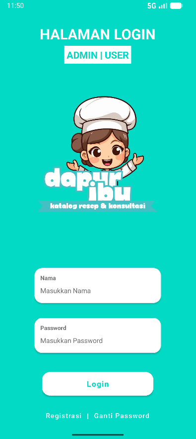 | 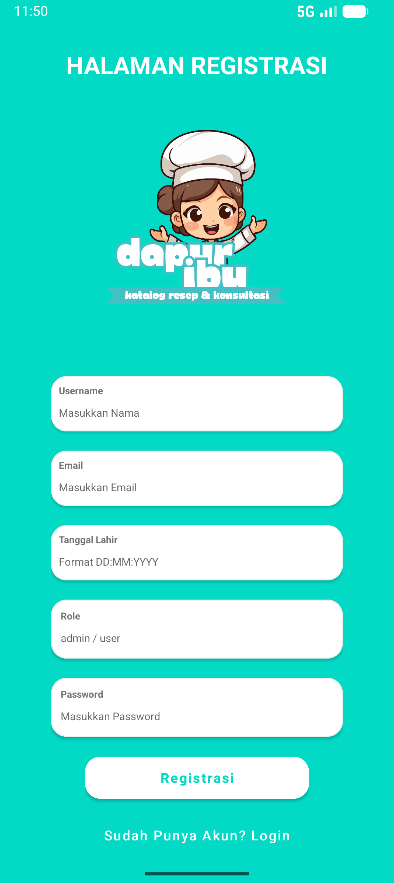 | 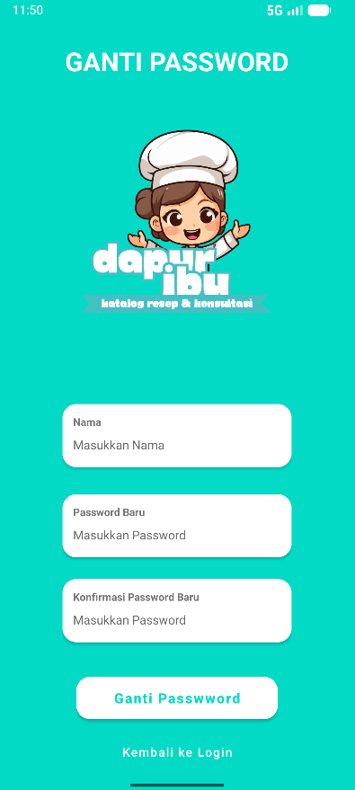 |
| _Antarmuka masuk yang aman._ | _Pendaftaran akun baru._ | _Manajemen kata sandi._ |

#### 👤 Fitur Pengguna (User Role)
| **Home User** | **Katalog Resep** | **Detail Resep** |
| :---: | :---: | :---: |
| 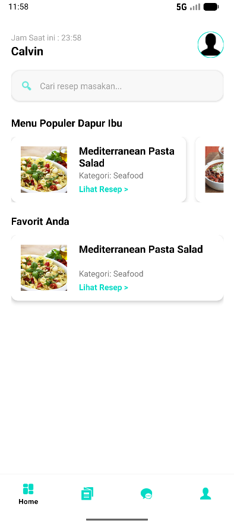 | 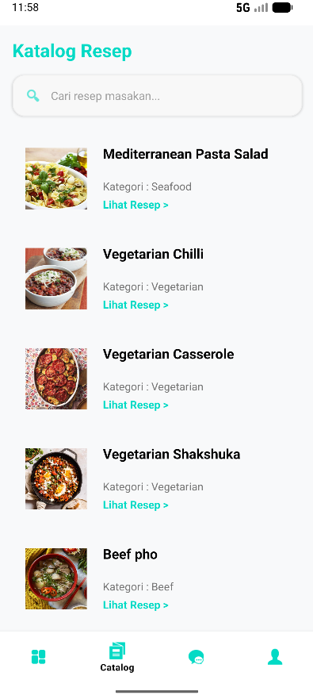 | 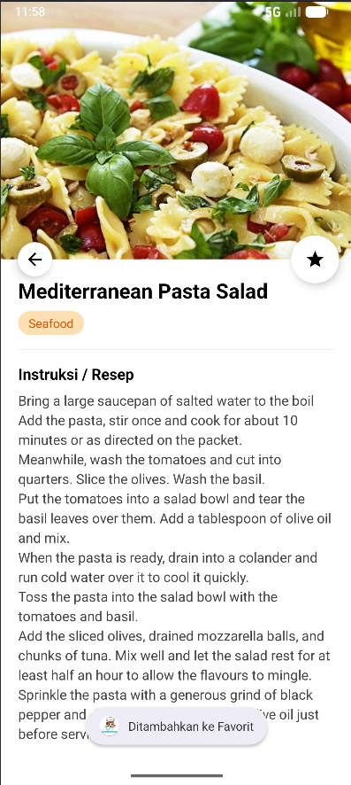 |
| _Dashboard utama pengguna._ | _Eksplorasi berbagai resep._ | _Langkah & bahan masakan._ |

| **Chat Konsultasi** | **Profile User** |
| :---: | :---: |
| 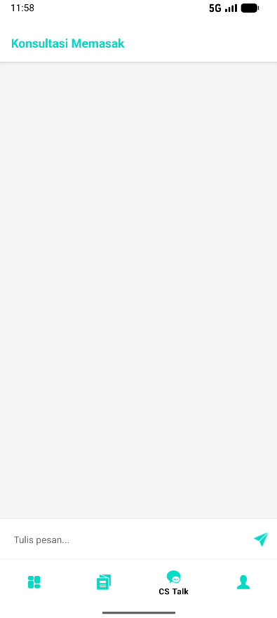 | 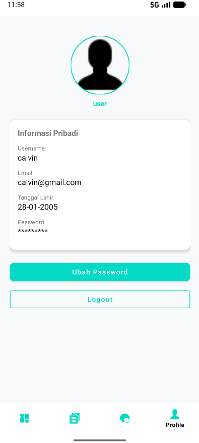 |
| _Tanya jawab dengan admin._ | _Kelola informasi akun._ |

#### 🛠️ Fitur Pengelola (Admin Role)
| **Dashboard Admin** | **Manajemen Katalog** | **Respon Chat** | **Profile Admin** |
| :---: | :---: | :---: | :---: |
| 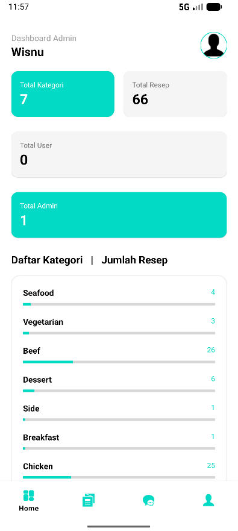 | 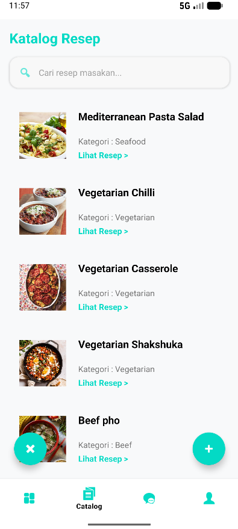 | 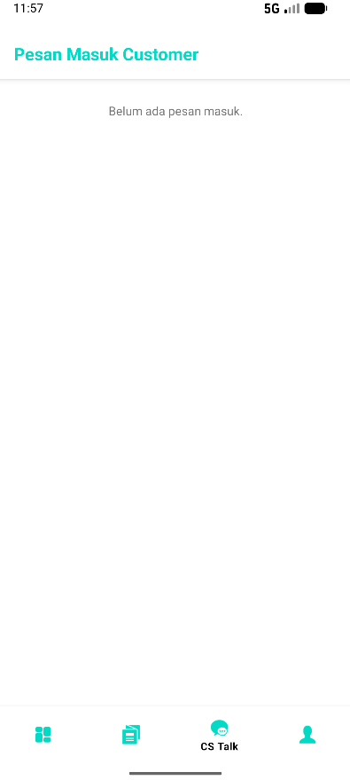 | 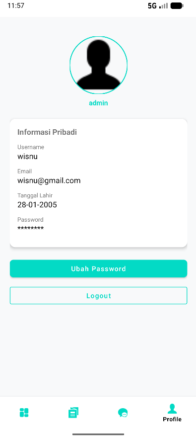 |
| _Ringkasan data aplikasi._ | _Tambah & edit data resep._ | _Layanan bantuan pengguna._ | _Akun khusus pengelola._ |

<p align="center">
  <br>
  <i>"Memasak jadi lebih mudah dan menyenangkan bersama Dapur Ibu"</i>
</p>

<p align="right">(<a href="#kotlin-projectdapuribu">Kembali ke atas ⬆️</a>)</p>
